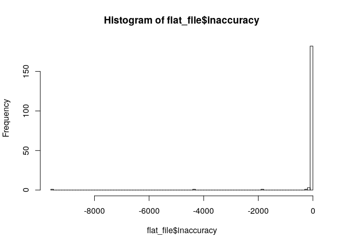

Population analysis
================

Idenitifying the population living outside of a 5km radius of the
nearest HF per district

### Libraries

``` r
require(raster)
require(sp)
require(rgdal)
require(rts)
require(dplyr)
require(tidyr)
require(rgdal)
require(rgeos)
require(spatstat)
require(maptools)
require(gdata)
require(geosphere)
library(sf)
library(gdalUtils)
library(gridsample)
```

### Preparatory set-up

Populate your `data` folder with the following files:

``` 
 [1] "cmr_bsgme_v0a_100m_2018.tif" "CMR_HDs.dbf"                
 [3] "CMR_HDs.prj"                 "CMR_HDs.sbn"                
 [5] "CMR_HDs.sbx"                 "CMR_HDs.shp"                
 [7] "CMR_HDs.shx"                 "CMR_HFs_GPS_Public.csv"     
 [9] "cmr_ppp_2018.tif"            "rcode.zip"                  
```

### Import shapefile

``` r
cmrshp <- readOGR("data", "CMR_HDs")
```

    OGR data source with driver: ESRI Shapefile 
    Source: "/home/joebrew/Documents/who_galatas/data", layer: "CMR_HDs"
    with 189 features
    It has 7 fields

### Import HF GPs coordinates

``` r
hfpub <- read.csv("data/CMR_HFs_GPS_Public.csv")
hfpub <- na.omit(hfpub)
coordinates(hfpub) <- ~Long+Lat
proj4string(hfpub) <- proj4string(cmrshp)
```

### Import raster

``` r
# Read the raster
# poprast <-raster("data/cmr_bsgme_v0a_100m_2018.tif")
poprast <- raster('data/cmr_ppp_2018.tif')#https://www.worldpop.org/geodata/summary?id=5849
# strata <- rasterize(cmrshp,poprast, field="Map_Code")
```

### Estimate the total population according to the entire file

``` r
sum(values(poprast), na.rm = T)
```

    [1] 26391583

### Trim the raster to only fit the area

### Estimate the population per polygon

``` r
# The below operation is slow, so saving a temp file to speed up on multiple runs
if('x.RData' %in% dir()){
  load('x.RData')
} else {
  x <- raster::extract(poprast, cmrshp, method = 'sum', na.rm = TRUE)
  save(x, file = 'x.RData')
}
populations <- lapply(x, sum, na.rm = T)
populations <- unlist(populations)
# Test to ensure we're on the right track
sum(populations)
```

    [1] 26281588

``` r
# Insert the polygon-specific populations
# into the spatial df
cmrshp@data$population <- populations
```

## Create 5km buffers around health posts

``` r
# devtools::install_github("valentinitnelav/geobuffer")
library(geobuffer)

# Get buffered areas for 5 km
km <- 5
bufs <- geobuffer_pts(xy = hfpub, dist_m = 100*km^3)
# bufs <- spTransform(bufs, CRS(cmrshp))
proj4string(bufs) <- proj4string(cmrshp)
```

## Get the polygon (district) for each health post

``` r
# index numbers
indices <- sp::over(hfpub, polygons(cmrshp))

# names
districts <- cmrshp@data$District[indices]

# insert names and index numbers into dataset
hfpub@data$District <- districts
hfpub@data$District_index <- indices
```

## Get the population of the district of each health facility

``` r
hfpub@data <- left_join(hfpub@data,
               cmrshp@data %>%
                 dplyr::select(District, population))
```

## Get the close / far population

``` r
if('cmrshp.RData' %in% dir()){
  load('cmrshp.RData')
} else {
  # Make the buffers into a spatial polygon dataframe
  # bufs and hfpub are ordered identically, so we can ignore ids on the join
  df <- SpatialPolygonsDataFrame(Sr = bufs,
                                 data = hfpub@data,
                                 match.ID = FALSE)
  # Take a look at all the buffered areas
  plot(df)
  
  # "Collapse" the buffered areas into one
  df_collapsed <- gUnaryUnion(df)
  
  # Take another look
  plot(cmrshp, col = adjustcolor('blue', alpha.f = 0.3), border = NA)
  plot(df_collapsed, col = 'red', add = T, border = NA)
  
  # Create a "cleaner" spatialPolygonsDataFrame with only two areas
  # Start by collapsing the overall shapefile
  hole <- gUnaryUnion(cmrshp)
  hole <- SpatialPolygonsDataFrame(Sr = hole, data = data.frame(id = 1))
  library(spatialEco)
  cmrshp_collapsed <- remove.holes(hole) #and removing vestigial holes
  # Combine the in and out areas
  x <- rgeos::gDifference(cmrshp_collapsed, df_collapsed)
  # Now x is "outside" and df_collapsed is "inside". Combine them:
  outside <- SpatialPolygonsDataFrame(Sr = x, data.frame(where = 'Outside'))
  inside <- SpatialPolygonsDataFrame(Sr = df_collapsed, data.frame(where = 'Inside'))
  proj4string(outside) <- proj4string(inside) <- proj4string(cmrshp)
  combined <- rbind(outside, inside)
  
  # Take another look
  plot(combined, col = c('grey', 'yellow'))
  
  # Note that there are only two rows in the associated dataframe = in or out
  combined@data
  
  # Make a spatial pixels df
  r = brick(poprast)
  r <- as(r, "SpatialPixelsDataFrame")
  names(r@data) <- c('population')
  # Make into a spatial points dataframe
  x <- SpatialPointsDataFrame(coords = coordinates(r),
                              data = r@data)

  # Now loop through each district calculating the number of in/out people
  library(sf)
  cmrshp@data$close <- NA
  cmrshp@data$far <- NA
  for(i in 1:nrow(cmrshp@data)){
    message(i)
    
    # Get shape of area
    this_shp <- cmrshp[i,]
    
    # Get the combined (in/out) areas for this district
    this_combined <- crop(combined, this_shp)

    # Divide into the inside/outside areas
    this_inside <- this_combined[this_combined@data$where == 'Inside',]
    this_outside <- this_combined[this_combined@data$where == 'Outside',]
    
    # Crop the raster to only fit the area in question
    if(nrow(this_inside) > 0){
      cropped_inside <- crop(poprast, this_inside)
      cropped_inside <- mask(cropped_inside, this_inside)
      population_inside <- sum(values(cropped_inside),na.rm = T)
    } else {
      population_inside <- 0
    }
    
    if(nrow(this_outside) > 0){
      cropped_outside <- crop(poprast, this_outside)
      cropped_outside <- mask(cropped_outside, this_outside)
      population_outside <- sum(values(cropped_outside), na.rm = T)
    } else {
      population_outside <- 0
    }
    
    # Now insert into dataset
    cmrshp@data$close[i] <- population_inside
    cmrshp@data$far[i] <- population_outside
  }
  save(cmrshp, file = 'cmrshp.RData')
  }
```

## Wrap-up

The `cmrshp` object now contains the “close” and “far” populations per
each of the 189 districts (“close” meaning within 5 km of any health
facility in any district, and “far” meaning not within 5km of a health
facility).

To get a flat file of these data, run something like:

``` r
flat_file <- cmrshp@data %>%
  dplyr::select(District, close, far, population) %>%
  mutate(inaccuracy = population - close - far)
```

Note that the `inaccuracy` column shows the difference between the
*total* population for the district, and the sum of the `close` and
`far` populations. These are very minor discrepancies occurring in only
very few districts. These inaccuracies are likely due to issues with
border handling (did not examine in depth).

``` r
table(flat_file$inaccuracy == 0)
```

``` 

FALSE  TRUE 
   13   176 
```

``` r
hist(flat_file$inaccuracy, breaks = 100)
```

<!-- -->

To peak at it:

``` r
head(flat_file)
```

``` 
   District     close       far population inaccuracy
1     Kaele 194287.98      0.00  194287.98     0.0000
2 Tchollire 128005.08 107843.96  235849.04     0.0000
3  Meiganga 104042.20  38067.72  141958.12  -151.8075
4     Lomie  37845.36  25285.92   63131.28     0.0000
5       Nwa  87403.05      0.00   87403.05     0.0000
6  Bandjoun  43152.87      0.00   43152.87     0.0000
```

To double-check overall sums, one compare the overall district-level
populations from the raster…

``` r
sum(populations)
```

    [1] 26281588

… with the total of the close and far populations per our calculations
(26.3 million):

``` r
flat_file %>%
  summarise(close = sum(close),
            far = sum(far))
```

``` 
     close     far
1 24957456 1340866
```

To write a csv:

``` r
library(readr)
flat_file %>% write_csv('flat_file.csv')
```

<joe@databrew.cc>
